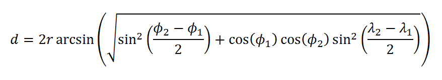
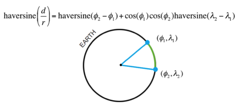

# Distance Calculator

This API service calculates the distance to our partners with offices within a given range of Starbucks Cafe Central
London (51.5144636,-0.142571)

## Tech Stack

- NodeJs v15.14.0
- Npm 7.7.6
- Dockerized environment (Docker version 20.10.8)
- Coded with Sails.js v1.5.0 https://sailsjs.com/
- ApiDoc 0.50.1 to generate endpoints
- Haversine formula on https://www.codegrepper.com/code-examples/javascript/haversine+formula+javascript (converted
  to **TypeScript**)
- Document source
  on https://www.geeksforgeeks.org/haversine-formula-to-find-distance-between-two-points-on-a-sphere/amp/

###Endpoints can be generated by using `npm run doc`
#### You can see the list of endpoints by clicking [http://localhost:1337/docs/](http://localhost:1337/docs/)
- GET /partners/:id
- -- id : Number
- GET /partners/distances?distance&[unit]&[order]
- -- distance : Number.Default is 0
- -- unit : String.Optional.Default value is 'K' which means KM (can be 'K' or 'N')
- -- order : String.Optional.Default value is 'a' which means ascending order (can be 'a' or 'd')


### How to run

- You can run this project via Docker, to to this:

```bash
 git clone https://github.com/yeminlideveloper/wm-api
 docker build -t wm/api ./
 docker run --rm -it --name wm-api -p 1337:1337 wm/api
```

or

- To run on your host, you need to have NodeJs and NPM installed (see **Tech Stack Section**)

```bash
git clone https://github.com/yeminlideveloper/wm-api
npm install && npm cache clean --force && npm install sails -g
node app.js # https://sailsjs.com/documentation/tutorials/using-type-script
```

if everything went well, open [http://localhost:1337](http://localhost:1337) on your browser.

Of course, this process is done with the Haversine formula, which I try to explain in detail below.

Given latitude and longitude in degrees find the distance between two points on the earth.

If we need to calculate the distance between two points or you want to find closest from position to your current
location let me introduce haversine-geolocation module. It based on the Haversine Formula:



### The Haversine Formula



### Pseudocode

```
dlon = lon2 - lon1
dlat = lat2 - lat1
a = (sin(dlat/2))^2 + cos(lat1) * cos(lat2) * (sin(dlon/2))^2
c = 2 * atan2( sqrt(a), sqrt(1-a) )
d = R * c (where R is the radius of the Earth)
```

R = 6367 km OR 3956 mi is the radius of the world

The great circle distance or the orthodromic distance is the shortest distance between two points on a sphere (or the
surface of Earth). In order to use this method, we need to have the co-ordinates of point A and point B.The great circle
method is chosen over other methods. First, convert the latitude and longitude values from decimal degrees to radians.
For this divide the values of longitude and latitude of both the points by 180/pi. The value of pi is 22/7. The value of
180/pi is approximately 57.29577951. If we want to calculate the distance between two places in miles, use the value 3,
963, which is the radius of Earth. If we want to calculate the distance between two places in kilometers, use the value
6, 378.8, which is the radius of Earth.

The obtained distance, d, is in miles. If you want your value to be in units of kilometers, multiple d by 1.609344. d in
kilometers = 1.609344 * d in miles Thus you can have the shortest distance between two places on Earth using the great
circle distance approach.

